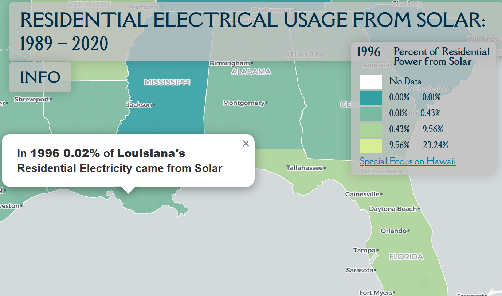

# Solar Power Adoption USA

An interactive web map that displays the growth of residential solar power adoption in the United States from 1989 to 2020. This project visualizes the percentage of residential electrical consumption derived from solar power across different states and years.

## Features

- Dynamic color-coding to visualize the percentage of residential electrical consumption from solar power
- Year slider to explore solar power adoption over time
- Autoplay functionality for a hands-free browsing experience
- Modal with detailed information about the map, data sources, and observed patterns

## Technologies Used

- Leaflet - An open-source JavaScript library for interactive maps
- Chroma.js - A library for color scale generation and color manipulation
- D3.js - A JavaScript library for manipulating documents based on data

## Getting Started

1. Clone this repository to your local machine.
2. Open the index.html file in your preferred web browser.
3. Explore the growth of solar power adoption in the United States from 1989 to 2020.

## Data Sources

- US Energy Information Administration (EIA) API Dashboard: [State Energy Data System (SEDS)](https://www.eia.gov/opendata/browser/seds)
- State polygons: [Natural Earth](https://www.naturalearthdata.com/)

## License

This project is licensed under the MIT License.

## Acknowledgements

US Energy Information Administration for providing the energy data
Natural Earth for providing the state polygons